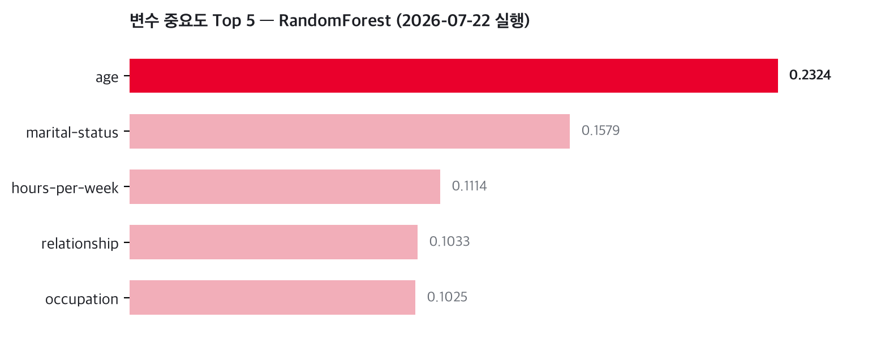
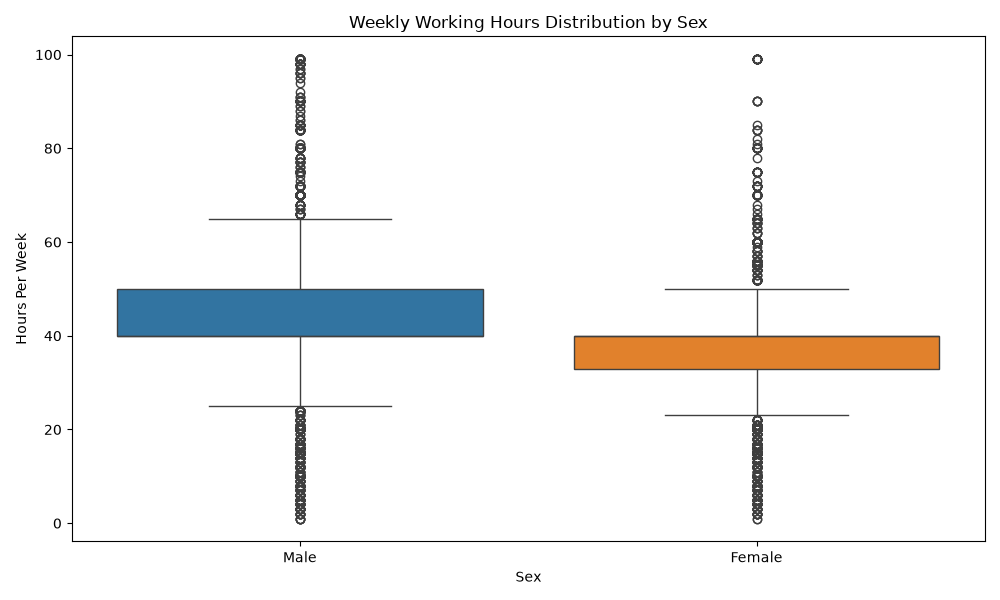
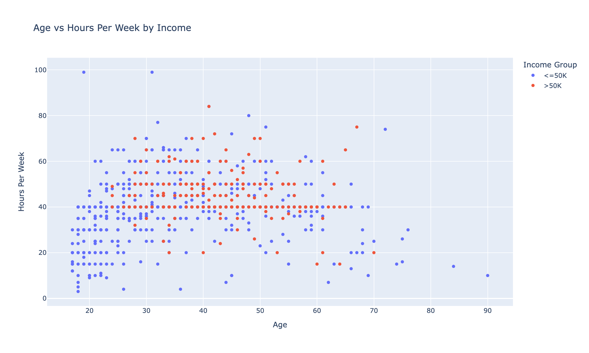

# 연봉 예측에 가장 큰 영향을 준 변수는 무엇인가?


SKALA 광주캠퍼스 2반 **5조** — [Day 2] 종합실습: **End2End 데이터 분석 프로젝트** (UCI Adult Census Income)

`python main.py` **한 번의 실행**으로 데이터 로딩부터 리포트 생성까지 5단계 파이프라인이 완주됩니다.


## 핵심 결과

> **답: age(나이), 중요도 0.2324.** 예상('학력이 가른다')과 달리 education은 Top5 밖이었고,
> 가족관계 신호(marital-status + relationship, 합산 0.2612)가 사실상 최대 요인.
> 고소득층의 특징은 **"30~50대 · 기혼/가장 · 주 40시간 이상 근무"**.

| 지표 | 값 |
|---|---|
| 정제 데이터 | 32,561 → **30,139행** (중복 24 · 결측 2,398행 제거) |
| Welch t-test (주당 근무시간) | **t = 43.17, p < 1e-300** — 고소득 그룹이 주 **+6.36h** (45.71 vs 39.35) |
| RandomForest | **Accuracy 0.8358 · F1 0.6916 · >50K recall 0.7395** (vs LogReg 0.8031) |
| 변수 중요도 Top 3 | age 0.2324 · marital-status 0.1579 · hours-per-week 0.1114 |



통계 검정 → 시각화 → 모델 변수 중요도 세 경로가 **같은 결론으로 수렴**합니다. 상세 수치와 해석은 [outputs/report.md](outputs/report.md) (실행 시 자동 생성) 참고.

## 결과 미리보기

**소득 그룹별 주당 근무시간 (Seaborn 박스플롯)** — 고소득(>50K) 그룹의 사분위 전체가 40~50시간 구간으로 올라가 있어 t-test 결과(+6.36h, p < 1e-300)를 분포 수준에서 보여줍니다.



**나이–근무시간–소득 산점도 (Plotly, 1,000건 표본)** — 고소득(주황)이 30~50대 · 주 40시간 이상 구간에 밀집하고 20대 초반·단시간 구간에는 거의 없습니다. `outputs/plotly_chart.html`을 열면 확대·툴팁 인터랙션이 가능합니다.



## 실행 방법

```bash
git clone https://github.com/jang961111-hash/skala-data-analysis-gwangju-2-5.git
cd skala-data-analysis-gwangju-2-5
python -m venv .venv && source .venv/bin/activate   # Windows: .venv\Scripts\activate
pip install -r requirements.txt
python main.py    # 반드시 레포 루트에서 실행
```

- 최초 실행 시 원본 데이터를 `data/raw/adult.data`로 자동 다운로드합니다.
- 어떤 단계가 실패해도 파이프라인은 끝까지 돌고, `outputs/report.md`에 단계별 상태가 표기됩니다 (오류 격리 설계).
- 로그: `outputs/pipeline.log`

## 프로젝트 구조

```
skala-data-analysis-gwangju-2-5/
├── main.py                      # 실행 진입점 — 5단계를 개별 try-except로 연결
├── src/
│   ├── load.py                  # 1. 데이터 준비 (Pandas/Polars 비교, 정제, EDA)
│   ├── viz.py                   # 2. 시각화 (Seaborn 박스플롯 + Plotly 산점도)
│   ├── stats_test.py            # 3. 통계 분석 (기술통계·상관·t-test)
│   ├── model.py                 # 4. ML Pipeline (전처리+모델+평가+joblib)
│   └── report.py                # 5. report.md 자동 생성 (Jinja2)
├── templates/report_template.md # Jinja2 리포트 템플릿
├── docs/decisions.md            # 팀 의사결정 기록 (피처 확정·결측/이상치 방침·모델 선택 근거)
├── data/raw/                    # 원본 데이터 — git 제외, 실행 시 자동 다운로드
└── outputs/                     # 차트·report.md·모델·로그 — 최종 통합 시 1회 커밋
```

## 역할 분담

| 단계 | 모듈 | 브랜치 | 담당 |
|---|---|---|---|
| 1. 데이터 준비 (Pandas/Polars 비교, 결측·중복, EDA) | `src/load.py` | `feat/load` | 장병헌 |
| 2. 시각화 (Seaborn + Plotly) | `src/viz.py` | `feat/viz` | 김단빈 |
| 3. 통계 분석 (기술통계·상관·t-test) | `src/stats_test.py` | `feat/stats` | 박연주 |
| 4. ML Pipeline (전처리+모델+평가+joblib) | `src/model.py` | `feat/model` | 김승현 |
| 5. report.md 자동 생성 + 통합·머지 | `src/report.py`, `main.py` | `feat/report` | 장병헌 (메인테이너) |

## 설계 원칙

- **단계 분리** — 각 단계를 `src/` 모듈 하나씩 `run()` 함수로 분리, 독립 실행 가능
- **오류 격리** — `main.py`가 각 단계를 import 포함 개별 try-except로 연결, 한 파트가 깨져도 리포트는 항상 생성
- **계약 고정** — `run()` 시그니처와 반환 dict 키를 팀 계약으로 고정, 4명 병렬 개발에도 통합 충돌 없음

## 협업 방식

- **GitHub Flow** — main 직접 push 금지, feature 브랜치 → PR → 메인테이너 리뷰·병합 (PR #1 ML · #3 통계 · #4 시각화 병합 완료)
- **커밋 컨벤션** — `type: 한글 설명` (`feat:` `fix:` `docs:` `chore:`)
- **머지 전 셀프체크** — 주석 · try/except 예외처리 · 레포 루트에서 `python main.py` 실행 확인
- **산출물 규칙** — `data/`·`outputs/`는 평시 .gitignore, 최종 통합 시 메인테이너가 1회 커밋

## 데이터 출처

- [Adult Census Income — UCI ML Repository](https://archive.ics.uci.edu/ml/machine-learning-databases/adult/adult.data) (1994 미국 인구조사, 32,561행 × 15열)
- 주의: 결측치가 NaN이 아니라 문자열 `" ?"`로 들어 있음 — Pandas는 `na_values="?"`(공백 없음), Polars는 `null_values=" ?"`(공백 포함)로 **서로 반대**. 상세는 [docs/decisions.md](docs/decisions.md)
